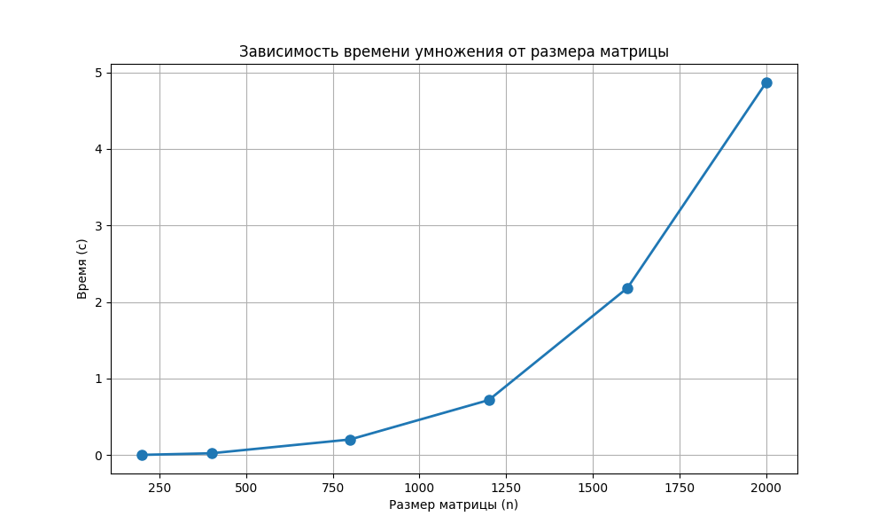

# Лабораторная работа №1: Перемножение квадратных матриц

**Выполнил:** Кузнецов Валентин Дмитриевич
**Группа:** 6213 

## Цель работы
Реализовать программу на C++ для умножения двух квадратных матриц, измерить время выполнения для различных размеров, провести верификацию результатов с помощью стороннего ПО (NumPy).

## Описание реализации
Программа на C++ (`matrix_mult.cpp`) реализует умножение матриц алгоритмом (три вложенных цикла) с оптимизацией порядка обхода (ikj) для улучшения кэш-локальности. Входные данные читаются из текстовых файлов, результат сохраняется в файл. Время умножения замеряется с помощью `std::chrono`.

Для автоматизации экспериментов и верификации используется скрипт на Python (`script.py`), который:
- генерирует случайные матрицы заданных размеров;
- запускает программу на C++;
- извлекает время выполнения;
- проверяет корректность умножения с помощью `numpy.dot`;
- строит график зависимости времени от размера.

## Методика экспериментов
Эксперименты проводились для следующих размеров квадратных матриц:  
200, 400, 800, 1200, 1600, 2000.

Для каждого размера генерировались две случайные матрицы с элементами в диапазоне [-10, 10]. 

## Результаты экспериментов

### Таблица времени выполнения
Таблица результатов

| Размер | Время (с) |
|--------|-----------|
| 200 | 0.003268 |
| 400 | 0.023924 |
| 800 | 0.204199 |
| 1200 | 0.719248 |
| 1600 | 2.184477 |
| 2000 | 4.868766 |

### График зависимости времени от размера матрицы

### Обсуждение результатов
Из таблицы и графика видно, что время выполнения быстро растёт с увеличением размера матрицы. При переходе от размера 200 к 2000 (рост в 10 раз) время увеличилось в **1490 раз** (4.868766 / 0.003268 ≈ 1490), что заметно превышает теоретический коэффициент 1000, ожидаемый для чисто кубической сложности O(n³).

Такое расхождение объясняется влиянием иерархической структуры памяти. Для малых размеров (200, 400) данные полностью помещаются в быстрый кэш процессора, поэтому скорость вычислений близка к пиковой. По мере увеличения размера матрицы объём данных превышает ёмкость кэша (например, для 2000 элементов матрица занимает 2000² × 8 байт ≈ 32 МБ, что больше типичного L3-кэша), и программа начинает часто обращаться к относительно медленной оперативной памяти. Это приводит к дополнительным задержкам, из-за которых фактическое время растёт быстрее, чем предсказывает простая модель O(n³).

Анализ роста между соседними размерами:
- 400/200: ожидаемое ускорение 8, фактическое 7.32 – небольшое отклонение из-за начала нехватки кэша.
- 800/200: ожидаемое 64, фактическое 62.5 – ещё близко.
- 1600/200: ожидаемое 512, фактическое 668 – превышение становится заметным.
- 2000/200: ожидаемое 1000, фактическое 1490 – значительное превышение, указывающее на то, что для размера 2000 доминируют обращения к памяти.

Таким образом, полученные данные хорошо иллюстрируют не только алгоритмическую сложность, но и важность учёта особенностей аппаратного обеспечения при оценке производительности реальных программ.

## Выводы
1. Разработана корректно работающая программа на C++ для умножения квадратных матриц.
2. Проведены эксперименты для шести различных размеров (от 200 до 2000), получены времена выполнения.
3. Верификация с помощью NumPy подтвердила правильность вычислений для всех размеров.
4. Обнаружено, что рост времени превышает теоретическую кубическую зависимость из-за эффектов кэш-памяти, что объясняет наблюдаемые отклонения.

## Инструкция по запуску

для компиляции кода на C++: g++ -std=c++17 -O2 matrix_mult.cpp -o matrix_mult
для запуска python скрипта: python script.py

