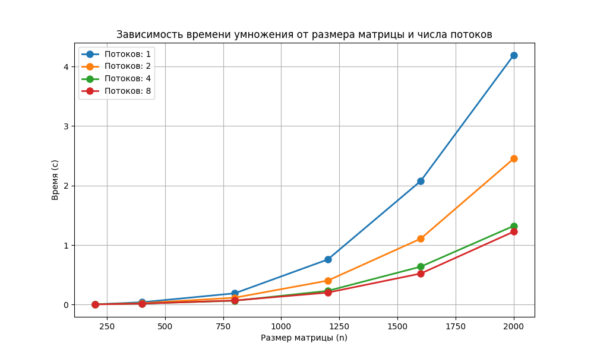

# Лабораторная работа №2: Параллельное умножение матриц с OpenMP

**Выполнил:** Кузнецов Валентин  
**Группа:** 6213  

## Цель работы
Модифицировать последовательную программу умножения квадратных матриц для параллельного выполнения с использованием технологии OpenMP. Провести экспериментальное исследование зависимости времени выполнения от размера матрицы и количества потоков, оценить ускорение и эффективность параллелизации.

## Описание реализации
Программа на C++ (`lab2.cpp`) реализует умножение двух квадратных матриц по алгоритму с тремя вложенными циклами (порядок обхода ikj для улучшения кэш-локальности). Параллелизация выполнена с помощью директивы OpenMP.
Внешний цикл по i распределяется между потоками, каждый поток вычисляет свою часть строк результирующей матрицы. Время умножения измеряется с помощью omp_get_wtime(). Входные данные читаются из текстовых файлов, результат сохраняется в файл.

Для автоматизации экспериментов и верификации используется скрипт на Python (lab2.py), который:

    генерирует случайные матрицы заданных размеров;

    запускает программу на C++ с разным количеством потоков (через переменную окружения OMP_NUM_THREADS);

    извлекает время выполнения;

    проверяет корректность умножения с помощью numpy.dot;

    строит график зависимости времени от размера и числа потоков.

## Методика экспериментов

Эксперименты проводились для следующих размеров квадратных матриц:
200, 400, 800, 1200, 1600, 2000.
Для каждого размера генерировались две случайные матрицы с элементами в диапазоне [-10, 10]. Каждый эксперимент повторялся для количества потоков 1, 2, 4, 8.
## Результаты экспериментов

## Таблица результатов (время в секундах)

| Размер | 1 | 2 | 4 | 8 |
|--------|---------|---------|---------|---------|
| 200 | 0.003264 | 0.004225 | 0.005261 | 0.002728 |
| 400 | 0.038461 | 0.023163 | 0.016745 | 0.015709 |
| 800 | 0.188657 | 0.114877 | 0.064046 | 0.068250 |
| 1200 | 0.756399 | 0.401696 | 0.229673 | 0.200691 |
| 1600 | 2.075885 | 1.106698 | 0.636521 | 0.520831 |
| 2000 | 4.191363 | 2.452099 | 1.321489 | 1.225019 |

## График зависимости времени от размера матрицы и числа потоков

## Обсуждение результатов

Влияние числа потоков на время выполнения

    Для матрицы 200×200 увеличение числа потоков не даёт выигрыша: время на 2 и 4 потоках даже больше, чем на одном (0.003264 → 0.004225 и 0.005261). Только на 8 потоках время снижается до 0.002728, но ускорение всего ~1.2. Это связано с тем, что объём вычислений мал, а накладные расходы на создание потоков и синхронизацию велики.

    Для 400×400 уже заметно ускорение: 0.038461 (1 поток) → 0.015709 (8 потоков), ускорение ≈2.45.

    Для 800×800 ускорение на 8 потоках составляет 0.188657 / 0.068250 ≈ 2.76. При этом на 4 потоках время меньше, чем на 8 (0.064046 против 0.068250). Это может указывать на насыщение пропускной способности памяти или неоптимальное распределение нагрузки.

    Для 1200×1200: ускорение на 8 потоках ≈ 0.756399 / 0.200691 ≈ 3.77.

    Для 1600×1600: ускорение ≈ 2.075885 / 0.520831 ≈ 3.99.

    Для 2000×2000: ускорение ≈ 4.191363 / 1.225019 ≈ 3.42.

Сравнение с теоретически ожидаемым ускорением

Идеальное ускорение для 8 потоков должно быть 8. В реальности максимальное ускорение составило около 4 (для 1600×1600). Это обусловлено:

    накладными расходами на OpenMP (создание потоков, синхронизация);

    неоптимальным использованием кэш-памяти (при статическом расписании строк могут возникать конфликты);

    ограничением пропускной способности памяти – для больших матриц узким местом становится не вычисления, а чтение/запись данных из ОЗУ.

## Инструкция по запуску
Компиляция программы на C++ (с поддержкой OpenMP)
g++ -std=c++17 -O2 -fopenmp lab2.cpp -o lab2

Запуск автоматического бенчмарка
python lab2.py

## Выводы

1. Программа успешно распараллелена с помощью OpenMP, верификация через numpy.dot подтвердила корректность для всех потоков и размеров.
2. Эксперименты показали, что распараллеливание эффективно только для матриц размером от 400 и выше. Для маленькой матрицы 200×200 накладные расходы превышают пользу.
3. Максимальное ускорение (около 4 раз) достигнуто для матриц 1600×1600 и 2000×2000. Причина ограниченного ускорения – вклад операций с памятью и синхронизации.
4. Для размера 800×800 наблюдался аномальный эффект: 8 потоков работали медленнее 4. Это следует учитывать при выборе оптимального числа потоков для конкретного размера.
5. Несмотря на ограниченную масштабируемость, OpenMP позволяет сократить время умножения больших матриц примерно в 3–4 раза на 8 потоках по сравнению с последовательной версией.

