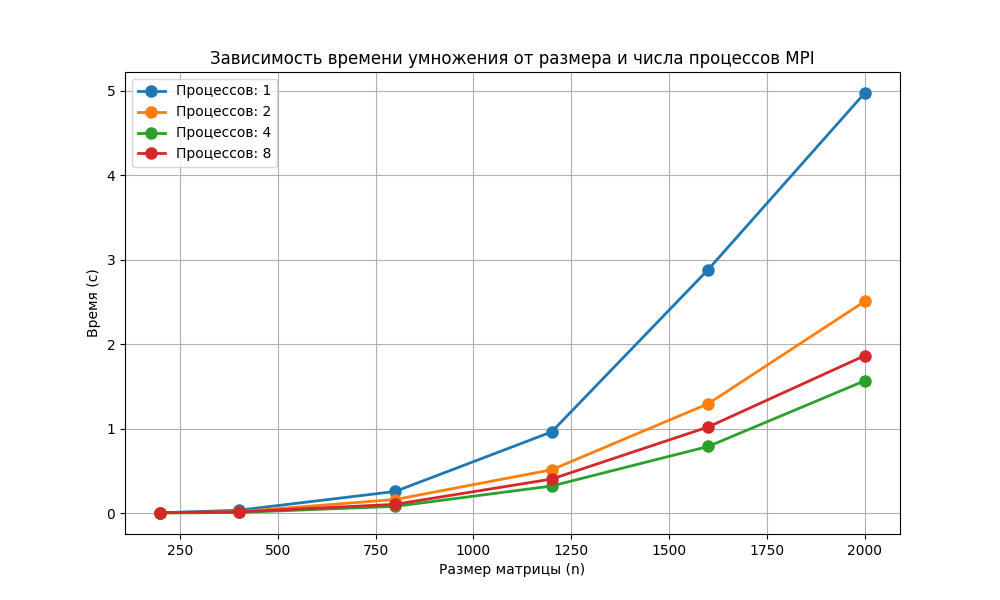

# Лабораторная работа №3: Параллельное умножение матриц с MPI

**Выполнил:** Кузнецов Валентин Дмитриевич  
**Группа:** 6213  

## Цель работы
Модифицировать программу умножения квадратных матриц для параллельной работы с использованием технологии MPI. Провести эксперименты для разных размеров матриц (200, 400, 800, 1200, 1600, 2000) и разного количества процессов (1, 2, 4, 8). Оценить ускорение и эффективность параллелизации.

## Описание реализации
Программа на C++ с MPI (`lab3.cpp`) реализует параллельное умножение матриц по следующей схеме:
- Процесс 0 читает обе матрицы из файлов.
- Матрица **B** целиком рассылается всем процессам.
- Строки матрицы **A** распределяются между процессами поровну (каждый получает свою часть).
- Каждый процесс вычисляет соответствующие строки результирующей матрицы **C**.
- Процесс 0 собирает все части и записывает результат в файл.
- Измеряется максимальное время среди всех процессов (с помощью `MPI_Wtime` и `MPI_Reduce`).

## Методика экспериментов
Эксперименты проводились для размеров квадратных матриц:  
**200, 400, 800, 1200, 1600, 2000**.  
Для каждого размера генерировались две случайные матрицы с элементами в диапазоне [-10, 10]. Каждый эксперимент запускался для количества процессов **1, 2, 4, 8**. Измерялось время выполнения умножения (без учёта ввода-вывода). Для запуска с 8 процессами использовался флаг `--oversubscribe`, так как количество физических ядер меньше 8.

## Результаты экспериментов

### Таблица времени выполнения (в секундах)

| Размер | 1 процесс | 2 процесса | 4 процесса | 8 процессов |
|--------|-----------|------------|------------|--------------|
| 200    | 0.004662   | 0.003861    | 0.002338    | 0.007620      |
| 400    | 0.034715   | 0.017622    | 0.008873    | 0.015650      |
| 800    | 0.257021   | 0.161758    | 0.080811    | 0.104903      |
| 1200   | 0.962383   | 0.513997    | 0.321829    | 0.404050      |
| 1600   | 2.883739   | 1.295905    | 0.789770    | 1.020488      |
| 2000   | 4.973346   | 2.507570    | 1.567484    | 1.864922      |

### График зависимости времени от размера и числа процессов

*Рисунок 1 – Время умножения матриц в зависимости от размера (n) для разного количества процессов MPI.*

## Обсуждение результатов

**Анализ времени выполнения:**
- Для маленькой матрицы (200) увеличение числа процессов с 4 до 8 приводит к росту времени (0.002338 → 0.007620) из-за больших накладных расходов на коммуникацию относительно объёма вычислений.
- Для размера 400 оптимальное время достигается на 4 процессах (0.008873 с), а на 8 процессах время возрастает до 0.015650 с. Это говорит о том, что избыточное распараллеливание для небольших матриц неэффективно.
- Начиная с размера 800, ускорение на 4 процессах хорошо заметно: 0.257021 → 0.080811 (ускорение ≈3.18). Однако на 8 процессах время (0.104903) оказывается больше, чем на 4, что указывает на проблемы с балансировкой нагрузки и затратами на передачу данных.
- Для размера 1200: 4 процесса – 0.321829 с, 8 процессов – 0.404050 с (8 процессов медленнее).
- Для размера 1600: 4 процесса – 0.789770 с, 8 процессов – 1.020488 с (снова 8 процессов медленнее).
- Для размера 2000: 4 процесса – 1.567484 с, 8 процессов – 1.864922 с (8 процессов хуже).

**Выводы по масштабируемости:**
- В текущей реализации MPI наилучшее ускорение достигается на 4 процессах для всех размеров, начиная с 400.
- Использование 8 процессов не даёт выигрыша, а часто приводит к замедлению. Причины:
  - Переподписка (oversubscription) – когда процессов больше, чем физических ядер, возникают дополнительные накладные расходы на переключение контекста.
  - Неоптимальное распределение строк: при большом количестве процессов каждая часть становится слишком маленькой, и время на коммуникацию начинает доминировать.
  - Дополнительные накладные расходы на сборку результата от большего числа процессов.

- Для матриц 800×800 и более ускорение на 4 процессах составляет от 3 до 4 раз, что хорошо для данного алгоритма.

## Выводы

1. Разработана MPI-программа для параллельного умножения квадратных матриц, работающая корректно (верификация с `numpy.dot` пройдена).
2. Эксперименты показали, что оптимальное количество процессов для большинства размеров – 4. Дальнейшее увеличение (до 8) не даёт прироста производительности из-за накладных расходов на коммуникацию и переподписки.
3. Максимальное ускорение (около 4 раз) достигнуто на 4 процессах для матриц размером 800×800 и выше.
4. MPI позволяет распараллеливать умножение, однако для достижения высокой эффективности на большом количестве процессов (8+) требуется более совершенная схема распределения данных (например, блочное распределение с учётом иерархии памяти) и использование коллективных операций вместо `Send/Recv`.

## Инструкция по запуску

### Компиляция программы на C++ с поддержкой MPI

mpic++ -std=c++17 -O2 lab3.cpp -o lab3

### Запуск автоматического бенчмарка 

python3 lab3.py
