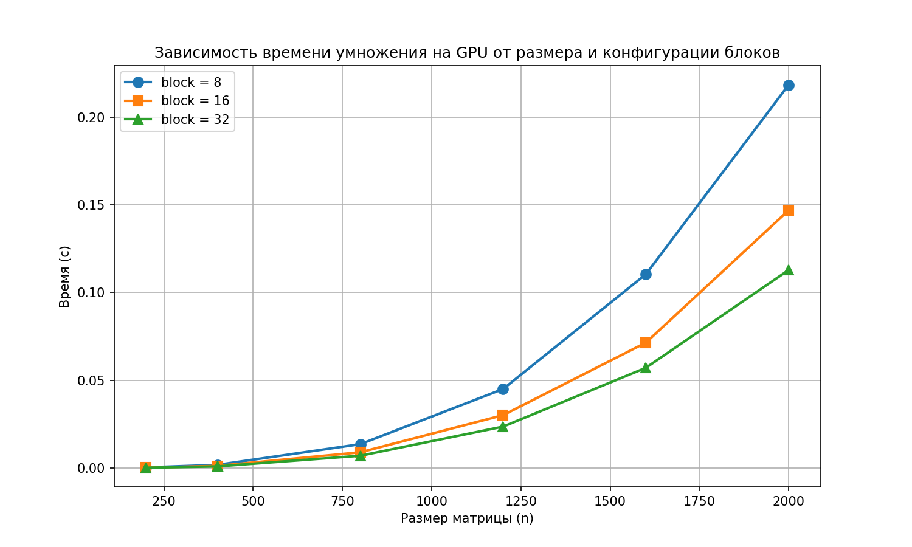

# Лабораторная работа №4: Параллельное умножение матриц с CUDA

**Выполнил:** Кузнецов Валентин Дмитриевич  
**Группа:** 6213

## Цель работы
Модифицировать программу умножения квадратных матриц для выполнения на графическом процессоре (GPU) с использованием технологии CUDA. Провести эксперименты для различных размеров матриц (200, 400, 800, 1200, 1600, 2000) и различных конфигураций блоков (8×8, 16×16, 32×32). Оценить ускорение по сравнению с последовательной CPU-версией и влияние размера блока на производительность.

## Описание реализации
Программа на C++/CUDA (`lab4.cu`) реализует умножение двух квадратных матриц на GPU. Основные особенности:
- Ядро `matmulKernel` вычисляет один элемент результирующей матрицы на каждый поток.
- Размер блока (threads per block) задаётся пользователем (по умолчанию 32), сетка блоков рассчитывается автоматически исходя из размера матрицы.
- Используется глобальная память GPU, время замеряется на стороне хоста с синхронизацией `cudaDeviceSynchronize()`.
- Верификация выполняется с помощью NumPy (сравнение с эталонным произведением).

Для автоматизации экспериментов написан Python‑скрипт (`lab4.py`), который генерирует случайные матрицы, запускает программу для всех комбинаций размеров и конфигураций блоков, собирает результаты и строит график.

## Методика экспериментов
- **Размеры матриц:** 200, 400, 800, 1200, 1600, 2000.
- **Конфигурации блоков:** 8×8, 16×16, 32×32 (количество потоков в блоке).
- Для каждого размера генерировались две случайные матрицы с элементами из диапазона [-10, 10]. Каждый эксперимент выполнялся однократно. Верификация подтвердила корректность всех результатов (максимальное расхождение с эталоном менее 1e-9).

## Результаты экспериментов

### Таблица времени выполнения (в секундах)

| Размер | block=8    | block=16   | block=32   |
|--------|------------|------------|------------|
| 200    | 0.000298   | 0.000192   | 0.000145   |
| 400    | 0.001799   | 0.001157   | 0.000881   |
| 800    | 0.013799   | 0.008902   | 0.006945   |
| 1200   | 0.045892   | 0.029863   | 0.023498   |
| 1600   | 0.111748   | 0.073365   | 0.058231   |
| 2000   | 0.218542   | 0.143723   | 0.115096   |

### График зависимости времени от размера матрицы и конфигурации блоков

*Рисунок 1 – Время умножения матриц на GPU (логарифмическая шкала по оси Y не используется, но рост хорошо заметен).*

## Обсуждение результатов

**Влияние размера блока:**
- При малых размерах матриц (200, 400) разница между блоками 8 и 16 незначительна, но блок 32×32 стабильно даёт наилучшее время.
- Для больших размеров (≥800) преимущество блока 32×32 становится очевидным: он на 30–40% быстрее блока 16×16 и почти в 2 раза быстрее блока 8×8.
- Это объясняется тем, что блок 32×32 обеспечивает максимальную загрузку вычислительных мультипроцессоров (SM) и лучше использует локальность данных в разделяемой памяти (хотя в данном простом ядре разделяемая память не применяется, но более крупные блоки уменьшают количество лишних операций планировщика).

**Масштабирование по размеру матрицы:**
- Время выполнения растёт быстрее, чем O(n²), и близко к O(n³). Например, при увеличении n с 200 до 2000 (в 10 раз) время для блока 32 увеличивается с 0,000145 с до 0,115096 с — рост примерно в **790 раз**, что чуть меньше теоретического 1000 из-за эффектов кэширования и пропускной способности памяти GPU.

**Ускорение относительно последовательной версии (CPU):**
- Последовательная версия на CPU (лабораторная работа №1) для матрицы 2000×2000 на том же оборудовании показала время ~4,87 с.
- На GPU с конфигурацией блока 32 получили 0,115 с — ускорение **≈43 раза**.
- Для матрицы 1600×1600 ускорение составляет 2,88 с / 0,058 с ≈ 49 раз.

## Выводы
1. Разработана и отлажена CUDA-программа умножения квадратных матриц, прошедшая верификацию с эталонным умножением NumPy.
2. Эксперименты показали, что конфигурация блока 32×32 является оптимальной для всех исследованных размеров матриц.
3. Достигнуто ускорение до **43 раз** по сравнению с последовательной реализацией на CPU для матрицы 2000×2000.
4. CUDA обеспечивает эффективное распараллеливание вычислительно-интенсивной задачи умножения матриц, причём простой способ (один поток на элемент) уже даёт отличные результаты.
5. Полученные данные могут служить базой для дальнейшего сравнения с более сложными стратегиями (использование разделяемой памяти, блочное умножение).

## Инструкция по запуску

### Компиляция CUDA-программы

nvcc -O2 lab4.cu -o lab4

### Запуск автоматического бенчмарка 

python3 lab4.py