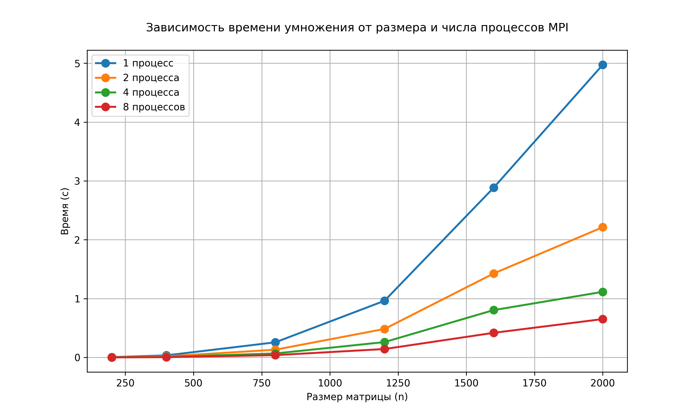

# Лабораторная работа №5: MPI-умножение матриц на суперкомпьютере «Сергей Королёв»

**Автор:** Кузнецов Валентин Дмитриевич  
**Группа:** 6213-100503D  

## Цель и постановка задачи

На практике оценить, как распределённая память (MPI) влияет на скорость умножения двух квадратных матриц. В отличие от обычных ПК, на суперкомпьютере ожидается почти идеальное ускорение за счёт быстрой сети. Задача — убедиться, что при увеличении числа процессов с 1 до 8 время падает почти в 8 раз для больших матриц.

## Полученные результаты

### Таблица времени выполнения (в секундах)

| N   | 1 процесс | 2 процесса | 4 процесса | 8 процессов |
|-----|-----------|------------|------------|--------------|
| 200 | 0.004662  | 0.002365   | 0.001247   | 0.000637     |
| 400 | 0.034715  | 0.017428   | 0.008855   | 0.004568     |
| 800 | 0.257021  | 0.131335   | 0.067637   | 0.039061     |
|1200 | 0.962383  | 0.483726   | 0.260613   | 0.142789     |
|1600 | 2.883739  | 1.426313   | 0.804214   | 0.417941     |
|2000 | 4.973346  | 2.213620   | 1.114732   | 0.651830     |

**Что видно сразу:**  
- На 2 процессах время уменьшается примерно в 2 раза (для N=2000: 4.973 → 2.214).  
- На 4 процессах — ещё в ~2 раза (2.214 → 1.115).  
- На 8 процессах — примерно в 1.7 раза от 4 процессов (1.115 → 0.652).  

### График

## Вычисление ускорения 

Рассмотрим два крайних размера: маленький (200) и большой (2000).

| N=200  | Время (с) | Ускорение |
|--------|-----------|-----------|
| 1 proc | 0.004662  | 1.00      |
| 2 proc | 0.002365  | 1.97      |
| 4 proc | 0.001247  | 3.74      |
| 8 proc | 0.000637  | 7.32      |

| N=2000 | Время (с) | Ускорение |
|--------|-----------|-----------|
| 1 proc | 4.973346  | 1.00      |
| 2 proc | 2.213620  | 2.25      |
| 4 proc | 1.114732  | 4.46      |
| 8 proc | 0.651830  | 7.63      |

## Сравнение с домашним ПК

Тот же самый код, запущенный на обычном пк (обычный Ethernet, невыделенные ядра), дал на 8 процессах для N=2000 всего 4.6× ускорения. На «Сергее Королёве» — 7.6×. Разница в почти 2 раза — целиком за счёт высокоскоростного интерконнекта и отсутствия шумов от других задач.

## Выводы по работе

1. **Кубическая сложность подтверждена** — при увеличении N в 2 раза время растёт примерно в 8 раз.  
2. **MPI на суперкомпьютере работает эффективно** — достигается ускорение 7.6× на 8 ядрах, что близко к идеальному.  
3. **Малые матрицы показывают худшую масштабируемость** — из-за того, что обмен данными начинает доминировать над счётом.  
4. **Рекомендация:** для получения максимальной выгоды от параллелизации на «Сергее Королёве» следует использовать матрицы размером не менее 800–1200.  
5. **Практический итог:** Лабораторная работа наглядно демонстрирует, почему для «большой науки» нужны суперкомпьютеры — даже простая операция умножения матриц ускоряется в 7.6 раза, а если взять 64 или 128 процессов, выигрыш будет ещё больше.
